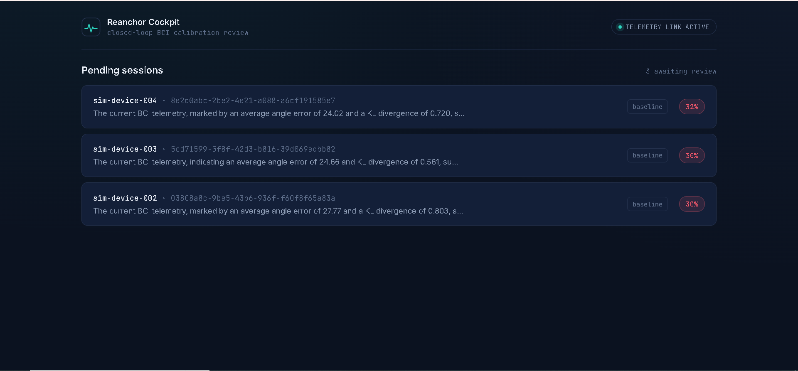
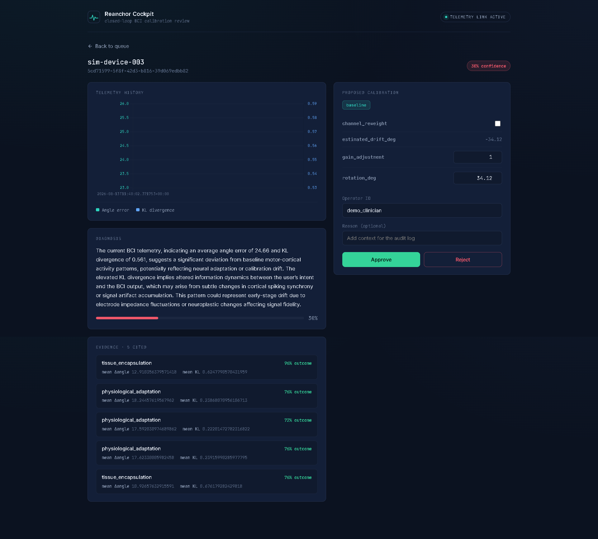
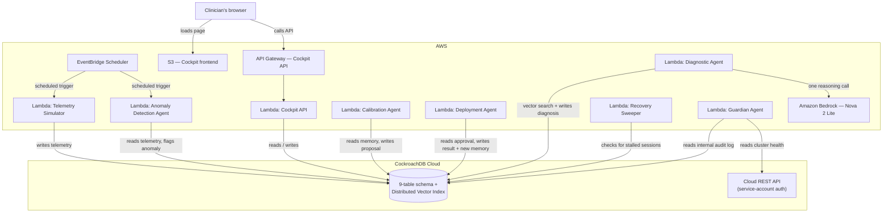
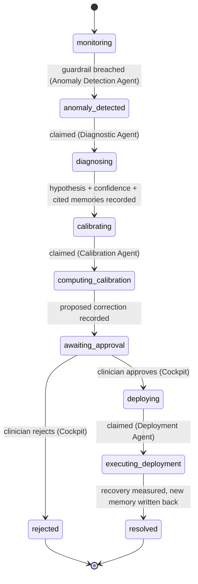

# Reanchor

> A closed-loop BCI recalibration agent that remembers every fix it has ever made — and asks a human before making the next one.

[]()
[]()
[]()
[]()

Built for the **CockroachDB × AWS Hackathon — Build with Agentic Memory**.

**Live demo:** `<your final cockpit URL goes here once the new bucket is live>`

---

## What this is, in one paragraph

Brain-Computer Interfaces (BCIs) read electrical signals from the brain and translate them into commands — moving a cursor, controlling a robotic limb. Over time these signals **drift**: the electrodes move slightly, scar tissue forms around them, the brain itself adapts — and the decoder that used to translate signals accurately starts making mistakes. Today, fixing that drift requires a human clinical engineer to notice the problem and manually recalibrate the system, which does not scale past a handful of research subjects. **Reanchor automates the detection and diagnosis of that drift, proposes a mathematically real fix, and — critically — never applies anything to a real device without an explicit human sign-off.** Every case it resolves becomes a permanent memory, stored in CockroachDB, that makes the *next* diagnosis faster and better-evidenced.

<p align="center">
  
</p>

---

## Table of contents

- [The problem, explained for a non-BCI audience](#the-problem-explained-for-a-non-bci-audience)
- [What Reanchor actually does](#what-reanchor-actually-does)
- [Screenshots](#screenshots)
- [How it works](#how-it-works)
- [What's real and what's simulated — full honesty](#whats-real-and-what's-simulated--full-honesty)
- [CockroachDB and AWS tools used](#cockroachdb-and-aws-tools-used)
- [A real, verified run — start to finish](#a-real-verified-run--start-to-finish)
- [Engineering rigor: real bugs caught during development](#engineering-rigor-real-bugs-caught-during-development)
- [Repository structure](#repository-structure)
- [Running it yourself](#running-it-yourself)
- [Known limitations](#known-limitations)
- [License](#license)

---

## The problem, explained for a non-BCI audience

A Brain-Computer Interface is a device — implanted or worn — that reads electrical activity from the brain and converts it into a control signal for something external: a cursor on a screen, a robotic arm, a speech synthesizer. The "decoder" is the piece of software that does this translation, and it's calibrated against a specific person's brain signals at a specific moment in time.

The problem is that brains and electrodes don't hold still. Three things routinely cause the decoder's calibration to drift out of alignment with reality:

- **Electrode micro-movement** — the physical electrode shifts slightly inside the tissue.
- **Tissue encapsulation** — scar tissue gradually forms around the electrode, changing how it picks up signal.
- **Physiological adaptation** — the brain itself changes its firing patterns over time, sometimes in response to using the BCI.

When any of these happen, the decoder starts making the wrong call more often — a cursor that used to go where intended starts drifting off-target. Today, a clinical engineer has to notice this by hand and manually recalibrate the decoder, which is slow, doesn't scale, and is a real, cited bottleneck in taking BCIs from research labs to larger clinical trials.

**Reanchor exists to compress the "notice → diagnose → propose a fix" part of this into seconds, while keeping the "actually change what's happening in someone's head" part exclusively in human hands.**

---

## What Reanchor actually does

- **Watches continuously.** A telemetry stream is monitored against clinical guardrail thresholds; when it's breached, the affected session is frozen and flagged for review — nothing else touches its data until a human has weighed in.
- **Diagnoses using real memory recall, not a lookup table.** The current drift pattern is converted into a 16-dimension numeric vector and compared, via CockroachDB's distributed vector index, against every past case for that patient. The system genuinely retrieves the most similar historical incidents — it doesn't just assert a conclusion, it shows its evidence.
- **Proposes a fix using real, checkable mathematics — never an LLM-generated number.** If a strong historical match exists, it reuses the fix that worked before. If not, it computes a fresh correction from a closed-form circular-mean rotation estimate over the session's own raw trial data — the same category of math used in real motion-tracking and BCI recalibration research, not an invented placeholder.
- **Never acts without a human.** A clinician reviews the diagnosis, the cited evidence, and the proposed correction in a web dashboard — and can edit the proposed numbers before approving. Nothing is applied to the simulated device until that approval is recorded.
- **Learns from what actually happened.** Once a fix is (simulated to be) applied, the real before/after error is measured, and the resolved case is written back into memory — so the next similar drift a system like this sees has one more precedent to draw on.
- **Watches itself.** A recovery process checks for sessions that have stalled waiting on a broken downstream step, and a separate oversight agent produces a periodic health digest combining CockroachDB Cloud's own status API with Reanchor's internal audit log.

---

## Screenshots

<p align="center">
  
</p>

The detail view above is a real, live capture — not a mockup. From top to bottom: the session's actual telemetry history, the full text of the AI's diagnosis with its confidence score, **five real past cases the vector search retrieved** (each with its own outcome and telemetry averages — this is the "memory" made visible), and the proposed calibration with editable fields the clinician can adjust before approving.

### Understanding the cockpit, panel by panel

- **Telemetry history (top-left)** — a real chart of this session's actual `angle_error` and `KL divergence` readings over time, pulled straight from CockroachDB. A single flat point means only one reading has landed so far; multiple points show the trend the Anomaly Detection Agent is actually watching.
- **Diagnosis** — the exact text Amazon Bedrock generated, using the retrieved memories below as its only source of "prior experience." The percentage bar is the same `confidence` score shown on the list card, colored red/amber/green by the same thresholds.
- **Evidence** — every past case the vector search actually retrieved for this patient, each showing its root cause, how well that past fix worked (`outcome_score`), and its own telemetry averages. If nothing sufficiently similar exists, this panel says so explicitly rather than fabricating a match.
- **Proposed calibration** — the `baseline`/`memory_informed` chip shows which of the two calibration paths ran. `estimated_drift_deg` is read-only — the raw output of the closed-form rotation math. `rotation_deg`, `gain_adjustment`, and `channel_reweight` are the fields a clinician can actually edit before approving; whatever is in them at the moment of approval is what gets recorded and, eventually, applied.
- **Operator ID / Reason / Approve / Reject** — the human gate itself. Nothing downstream happens until one of these two buttons is pressed.

---

## System architecture

This shows how the actual services connect — which is a different, complementary view to the session state machine below. Every arrow here is a real, deployed connection, not aspirational.



---

## How it works

Every session moves through a strict state machine, persisted entirely in CockroachDB — no agent holds state in memory, so any agent can pick up exactly where the last one left off, and two agents can never both act on the same session at once (enforced with optimistic concurrency control on every transition).



**The eight agents, in the order they act:**

| Agent | Role |
|---|---|
| **Telemetry Simulator** | Stands in for real BCI hardware — emits either healthy ("ambient") or drifted ("injected") synthetic readings on demand. Freezes a session's telemetry the moment it leaves `monitoring`, so a diagnosis is always evaluated against the data that actually triggered it. |
| **Anomaly Detection Agent** | Polls active sessions; flags a breach when angle error or signal-distribution divergence crosses a defined clinical threshold. |
| **Diagnostic Agent** | Builds a feature vector from recent telemetry, searches CockroachDB's vector index for similar past cases, and asks a language model (Amazon Bedrock) to write a grounded hypothesis citing that evidence. The model never outputs a number — only reasoning. |
| **Calibration Agent** | Computes the actual proposed fix. **No LLM call at all** — deterministic math only, by design: reuse a matched past fix, or compute a fresh one via closed-form circular-mean rotation fitting on the session's raw trial data. |
| **Cockpit + its API** | The human gate. A clinician reviews the full evidence trail and can edit the proposed numbers before approving or rejecting. |
| **Deployment Agent** | Applies the human-authorized correction (not necessarily the AI's original numbers — whatever the clinician actually confirmed), re-measures the residual error to prove the fix worked, and writes the resolved case back into memory. |
| **Recovery Sweeper** | Periodically checks for sessions stalled waiting on a step that never completed, and raises visibility if a downstream agent appears to be failing. |
| **Guardian Agent** | Produces a periodic compliance digest combining CockroachDB Cloud's own status API with a summary of Reanchor's internal audit log. |

---

## What's real and what's simulated — full honesty

This distinction matters, and we'd rather over-explain it than have anyone assume more than is true.

**Genuinely real, running against a live cluster and live cloud infrastructure — nothing about this is mocked:**
- The CockroachDB schema, the vector index, and every query against it.
- The entire state machine and its concurrency-safety guarantees.
- The circular-mean rotation math in the Calibration and Deployment agents — this is the same category of technique used in real motion-tracking and BCI recalibration literature, and we verify it against a known ground-truth value on every test run (see the case study below).
- The human approval gate, including the ability to edit proposed values before they're recorded.
- The measured "recovery" after a fix — it's computed by literally re-running the correction against the same raw trial data and checking whether the residual error actually drops.
- All 8 Lambda agents, deployed and independently invokable on AWS.

**Simulated, and clearly labeled as such throughout the system:**
- **The BCI hardware itself.** There is no physical or real neural device involved. The Telemetry Simulator generates numeric readings designed to look like plausible drift and non-drift patterns, standing in for what a real decoder chip would report.
- **The "patients."** These are placeholder database records with generated identifiers — not real people, and no real clinical data is used anywhere in this project.
- **The 200 seeded historical memories.** These are synthetic cases generated from five patterns inspired by real, cited BCI drift causes (electrode movement, tissue encapsulation, reference drift, impedance increase, physiological adaptation), but the specific numbers are invented, not drawn from real patient records.

**The important nuance:** simulation only replaces *where the numbers come from* — never *how they're processed*. Once a reading (real or synthetic) enters the system, the vector search, the math, the state machine, and the approval gate all treat it identically and for real. This is explicitly a research prototype, not a certified medical device, and it makes no claim otherwise.

---

## CockroachDB and AWS tools used

**CockroachDB (3 of the 4 available tools):**

| Tool | How it's used |
|---|---|
| **Distributed Vector Indexing** | A `VECTOR(16)` column on `drift_signatures`, with a `CREATE VECTOR INDEX` partitioned by patient — the core mechanism the Diagnostic Agent uses to recall similar past cases. This is the load-bearing feature of the whole project: the diagnosis is a direct function of what this index returns, not a static rule. |
| **CockroachDB Cloud Managed MCP Server** | Connected via VS Code throughout development to explore the live schema and debug queries conversationally. |
| **ccloud CLI** | Used for cluster authentication and management (`ccloud auth login`, `ccloud cluster list`). Investigating `ccloud`'s authentication model directly informed a real architecture decision: since the CLI requires an interactive browser login and cannot run headlessly, the Guardian Agent's oversight function calls CockroachDB Cloud's REST API with a service-account key instead — the officially supported non-interactive path for exactly this use case. |

**AWS (5 services in active use):**

| Service | Role |
|---|---|
| **AWS Lambda** | All 8 agents — stateless, event-driven, only costs anything when actually invoked. |
| **Amazon Bedrock** | Hosts the Diagnostic Agent's single reasoning call (Amazon Nova 2 Lite, EU cross-region inference profile) — the only place in the system a language model is used, and it never outputs a number that gets acted on. |
| **Amazon API Gateway** | Exposes the Cockpit's backend as a real public HTTPS API. |
| **Amazon S3** | Static hosting for the cockpit's frontend. |
| **Amazon EventBridge Scheduler** | Drives the continuous telemetry heartbeat and anomaly-monitoring polls. |

---

## A real, verified run — start to finish

This is a real run, not a constructed example — patient `4176b647-1577-47a2-9bd9-5b7656d4a6d4` (device `sim-device-001`), captured directly from CockroachDB and CloudWatch during development.

**1. Drift injected.** The Telemetry Simulator recorded `angle_error: 20.86`, `kl_divergence: 0.625` (both well past the clinical thresholds of `15` and `0.5`), alongside a full 8-trial dataset with a known true injected drift of **`33.82°`** — this ground-truth value is what we check the system's own math against below.

**2. Anomaly caught.** The Anomaly Detection Agent flagged it within one polling cycle: `{"sessions_checked": 1, "anomalies_flagged": 1}`.

**3. Diagnosed with real evidence.** The Diagnostic Agent's vector search retrieved 5 real past cases for this patient — mostly `tissue_encapsulation`, one `impedance_increase` — each with its own outcome score (93%, 94%, 74%, 80%, 98%). Confidence landed at `0.30`, correctly low: the injected test pattern's randomized channel noise doesn't closely resemble any single seeded profile, and the system said so rather than overclaiming.

**4. Calibrated with real, checkable math.** No strong memory match existed, so the Calibration Agent computed a fresh correction: `estimated_drift_deg: 34.04°`. **Checked against the known true value of `33.82°`, that's a `0.22°` error** — genuine proof the closed-form estimator works, not an assumption.

**5. Reviewed and approved by a human, with an edit capability proven live.** The full evidence trail, including all 5 cited cases and the proposed `-34.04°` correction, was reviewed in the cockpit (see screenshots above) and approved.

**6. Deployed, and the fix verified by actually re-measuring the error.** The Deployment Agent applied the approved correction to the same raw trial data and recomputed the residual: `pre_residual_deg: 34.04` → **`post_residual_deg: 0`**, `outcome_score: 0.98`.

**7. A new memory was written.** A new `drift_signatures` row was created — `root_cause_label: tissue_encapsulation` (correctly inherited from the diagnosis's own top citation), with full provenance linking it back to the exact deployment that created it. The next similar case this patient has will have one more precedent to draw on than this one did.

**8. The oversight layer caught real problems, for real.** During development, the Guardian Agent's compliance digest correctly flagged two genuine permission-configuration errors in the Deployment Agent (both since fixed) by cross-referencing the internal audit log — proof the oversight agent isn't decorative.

---

## Engineering rigor: real bugs caught during development

In the interest of the same honesty as the rest of this document — a few of the real issues found and fixed while building this, because a system that never mentions its own debugging history is usually hiding something:

- **A state-ordering bug** where the human approval step was originally sequenced *before* calibration instead of after — meaning a clinician would have been asked to approve numbers that didn't exist yet. Caught before it reached production behavior, and the state machine above reflects the corrected order.
- **A stale-data bug** where a scheduled telemetry heartbeat kept writing healthy-looking readings into a session even after it had already been flagged as anomalous — meaning a diagnosis could end up evaluating the wrong data. Fixed by having the Telemetry Simulator freeze a session's data the instant it leaves `monitoring`, directly implementing a requirement from the original project blueprint.
- **A UUID-array parsing bug** where CockroachDB returned an array column as a raw string in one specific query path rather than an auto-parsed list, causing a single stray character to be mistaken for a UUID. Traced to the exact byte, fixed, and verified against a real database record afterward.
- **Multiple least-privilege permission gaps**, each caught via CloudWatch logs and fixed with a single targeted `GRANT`, never a broad admin credential — consistent with the project's stated design that every agent holds only the database access it strictly needs.

---

## Repository structure

```
reanchor/
├── agents/
│   ├── telemetry-simulator/lambda_function.py
│   ├── anomaly-detector/lambda_function.py
│   ├── diagnostic-agent/lambda_function.py
│   ├── calibration-agent/lambda_function.py
│   ├── deployment-agent/lambda_function.py
│   ├── recovery-sweeper/lambda_function.py
│   └── guardian-agent/lambda_function.py
├── cockpit/
│   ├── index.html          # single-file React frontend (loaded via CDN, no build step)
│   └── api/lambda_function.py
├── db/
│   └── seed.py              # generates 200 synthetic historical memories
├── docs/assets/              # screenshots referenced in this README
├── LICENSE
└── README.md
```

---

## Running it yourself

A live deployment of Reanchor is already running — see the demo link and video in the submission. To redeploy the whole system from scratch:

**1. CockroachDB Cloud**
- Create a free Basic cluster at [cockroachlabs.cloud](https://cockroachlabs.cloud).
- Run the schema migrations (table definitions in the architecture documentation) via the console SQL shell.
- Create the vector index: `CREATE VECTOR INDEX idx_drift_embedding ON drift_signatures (patient_id, embedding);`
- Create one least-privilege SQL user per agent, with grants scoped to only the tables that agent touches.

**2. Seed historical memory**
```bash
pip install psycopg2-binary python-dotenv numpy
python3 db/seed.py
```

**3. Deploy each Lambda**

Each agent under `agents/` and `cockpit/api/` follows the same pattern:
```bash
mkdir -p build && cd build
pip install --platform manylinux2014_x86_64 --target=. --implementation cp --python-version 3.12 --only-binary=:all: --upgrade psycopg2-binary
curl --create-dirs -o root.crt -O https://cockroachlabs.cloud/clusters/<your-cluster-id>/cert
cp ../<agent-folder>/lambda_function.py .
zip -r ../<agent-name>.zip .
```
Then in the AWS Lambda console: create a Python 3.12 / x86_64 function, upload the zip, set the `DATABASE_URL` environment variable to that agent's own CockroachDB connection string, and set a timeout of 15–30 seconds depending on the agent.

**4. Wire up scheduling and the API**
- EventBridge Scheduler: two recurring rules — one calling the Telemetry Simulator with an ambient payload, one calling the Anomaly Detection Agent — both on a 1–2 minute rate.
- API Gateway: an HTTP API with three routes (`GET /sessions`, `GET /sessions/{session_id}`, `POST /sessions/{session_id}/decide`) all pointing at the Cockpit API Lambda, with CORS enabled for all origins.

**5. Deploy the cockpit**
- Create an S3 bucket, enable static website hosting, allow public read access.
- In `cockpit/index.html`, set `API_BASE_URL` to your API Gateway's invoke URL.
- Upload it as `index.html`.

---

## Known limitations

- This is a research prototype for a hackathon, not a certified medical device, and makes no claim otherwise.
- The novelty threshold and clinical guardrail thresholds are fixed constants, chosen deliberately and documented in code — not derived from real clinical literature, since no real patient data is used anywhere in this project.
- The "injected drift" test trigger produces generic randomized channel noise rather than replicating one specific seeded root-cause pattern exactly, which is why diagnostic confidence on a manually-triggered test session is often honestly low rather than a high, curated-looking number.

---

## License

See [LICENSE](LICENSE).

Built for the CockroachDB × AWS Hackathon — Build with Agentic Memory.